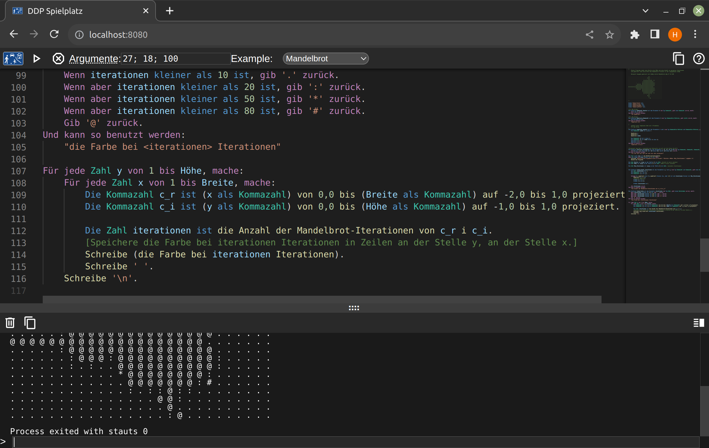

# Spielplatz

Ein online-Spielplatz für DDP.

Inspiriert von anderen Sprachen wie [Go](https://go.dev/play/), [Rust](https://play.rust-lang.org/?version=stable&mode=debug&edition=2021) und [Dart](https://dartpad.dev/?).



## Starten
### Vorraussetzungen
* Go version 1.20.0
* NodeJS

### Ausführen
Um das Programm zu starten führt man `run.sh` aus.

### Konfiguration
Man kann im root des Projektes eine `config.json` Datei erstellen um das Programm einszustellen.
Die standart Konfigurationsdatei sieht so aus.
```json
{
	"exe_cache_duration": 60,
	"run_timeout": 60,
	"port": "8080"
}
```