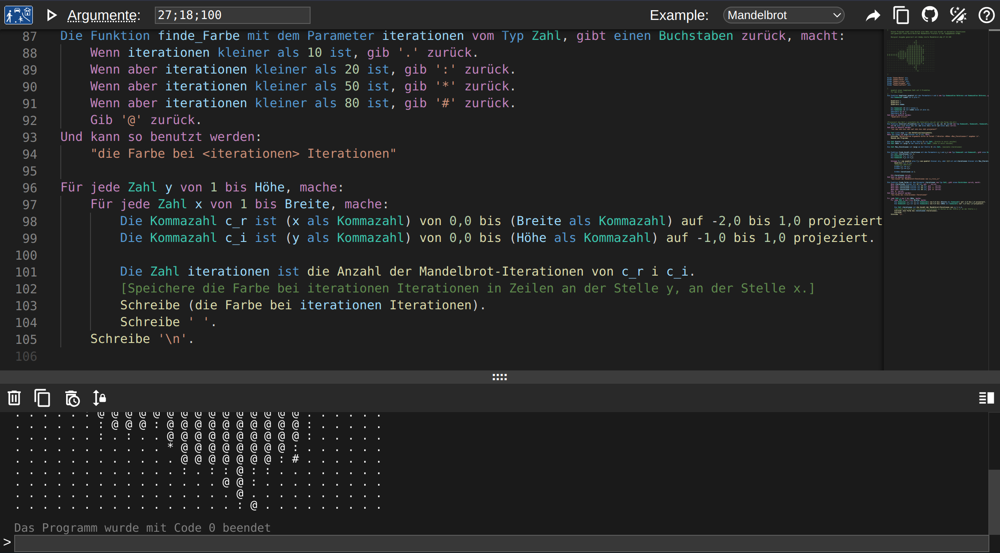
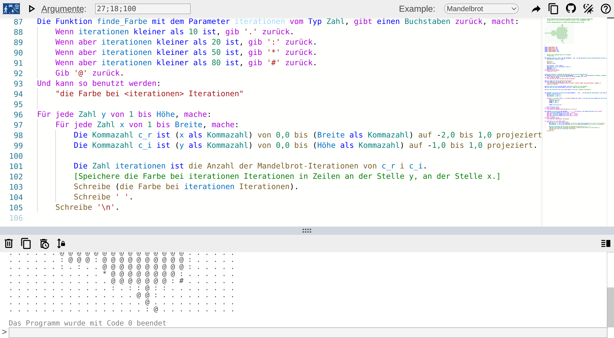

# Spielplatz

Ein online-Spielplatz um [DDP](https://github.com/DDP-Projekt/Kompilierer) auszuprobieren.\
Erreichbar unter https://ddp.le0n.dev/Spielplatz

Inspiriert von anderen Sprachen wie [Go](https://go.dev/play/), [Rust](https://play.rust-lang.org/?version=stable&mode=debug&edition=2021) und [Dart](https://dartpad.dev/?).

| dark mode | light mode |
|---|---|
|||

## Lokal Ausführen
### Vorraussetzungen
* Ein Linux Betriebssystem (das Linux-exklusive seccomp feature wird benutzt)
* [Go](https://go.dev/doc/install) (mindestens version 1.22.2)
* npm

### Installieren
1. Die Spielplatz und [Kompilierer](https://github.com/DDP-Projekt/Kompilierer) Repositories klonen
2. Den Kompilierer bauen
3. `make install-dependencies` ausführen

### Ausführen
Um das Programm zu starten führt man `run.sh` aus.
Das Makefile sollte dann alle Abhängigkeiten automatisch installieren (eventuell muss das sudo Passwort angegeben werden).

## Via Docker Ausführen
### Vorraussetzungen

* [Docker](https://docs.docker.com/get-docker/)

### Installieren

1. Das Spielplatz Repository klonen
2. Die entsprechende LLVM Versin von https://github.com/llvm/llvm-project/releases/tag/llvmorg-12.0.0 herunterladen 
3. Docker starten
4. `./docker-build.sh <llvm_archive>` auführen, wobei `<llvm_archive>` der Pfad zur heruntergeladenen LLVM Version ist

Bsp.:
```bash
wget https://github.com/llvm/llvm-project/releases/download/llvmorg-12.0.0/clang+llvm-12.0.0-x86_64-linux-gnu-ubuntu-20.04.tar.xz
./docker-build.sh clang+llvm-12.0.0-x86_64-linux-gnu-ubuntu-20.04.tar.xz
```

### Ausführen

Das Docker Image kann mit `docker run -p 8080:8080 ddp-spielplatz` als container gestartet werden.
Der Spielplatz sollte jetzt unter http://localhost:8080/Spielplatz erreicht werden können.

### Konfiguration
Man kann im root des Projektes eine `config.json` Datei erstellen um das Programm einszustellen.
Die standart Konfigurationsdatei sieht so aus.
```json
{
	"port": "8080",
	"exe_cache_duration": "1m",
	"run_timeout": "30s",
	"memory_limit_bytes": 4294967296,
	"cpu_limit_percent": 50,
	"max_concurrent_processes": 50,
	"process_aquire_timeout": "3s",
	"useHTTPS": false,
	"certPath": "",
	"keyPath": "",
	"pprof": false,
}
```
