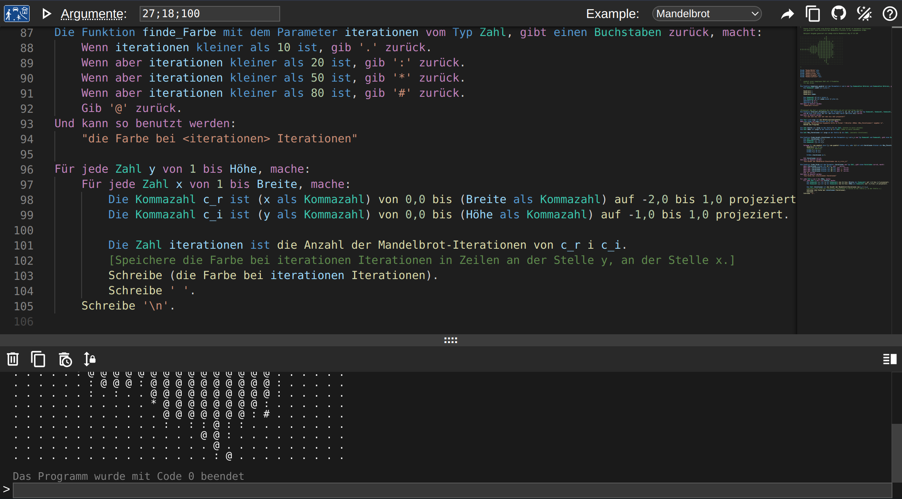
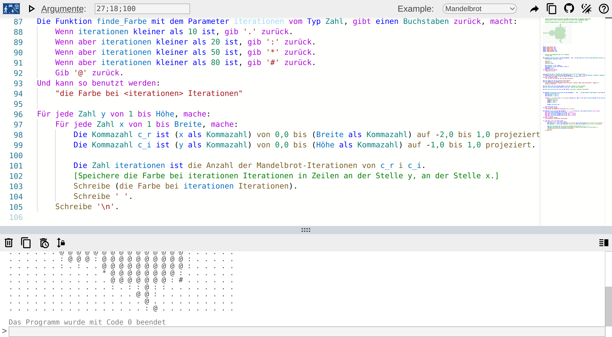

# Spielplatz

Ein online-Spielplatz für [DDP](https://github.com/DDP-Projekt/Kompilierer).

Inspiriert von anderen Sprachen wie [Go](https://go.dev/play/), [Rust](https://play.rust-lang.org/?version=stable&mode=debug&edition=2021) und [Dart](https://dartpad.dev/?).

| dark mode | light mode |
|---|---|
|||

## Lokal Ausführen
### Vorraussetzungen
* [Go](https://go.dev/doc/install) (mindestens version 1.20.0)
* npm

### Installieren
1. Die Git Repository clonen
2. `make install-dependencies` ausführen

### Ausführen
Um das Programm zu starten führt man `run.sh` aus.
Das Makefile sollte dann alle Abhängigkeiten automatisch installieren (eventuell muss das sudo Passwort angegeben werden).

### Konfiguration
Man kann im root des Projektes eine `config.json` Datei erstellen um das Programm einszustellen.
Die standart Konfigurationsdatei sieht so aus.
```json
{
	"port": "8080",
	"exe_cache_duration": "1m",
	"run_timeout": "30s",
	"memory_limit_bytes": 4294967296,
	"cpu_limit_percent": 50,
	"use_cgroups": true,
	"max_concurrent_processes": 50,
	"process_aquire_timeout": "3s"
}
```
